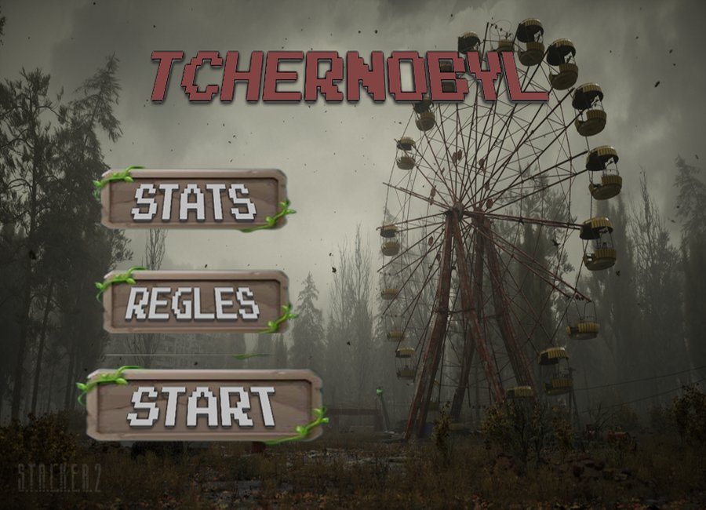
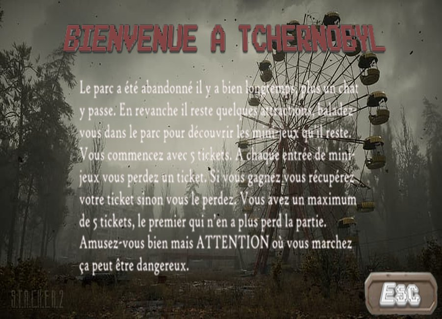
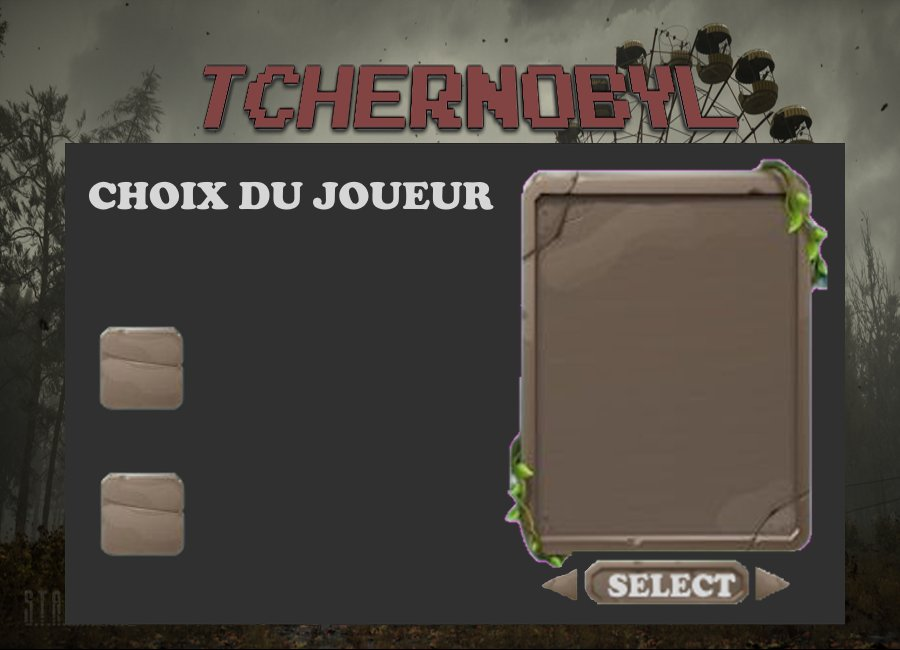
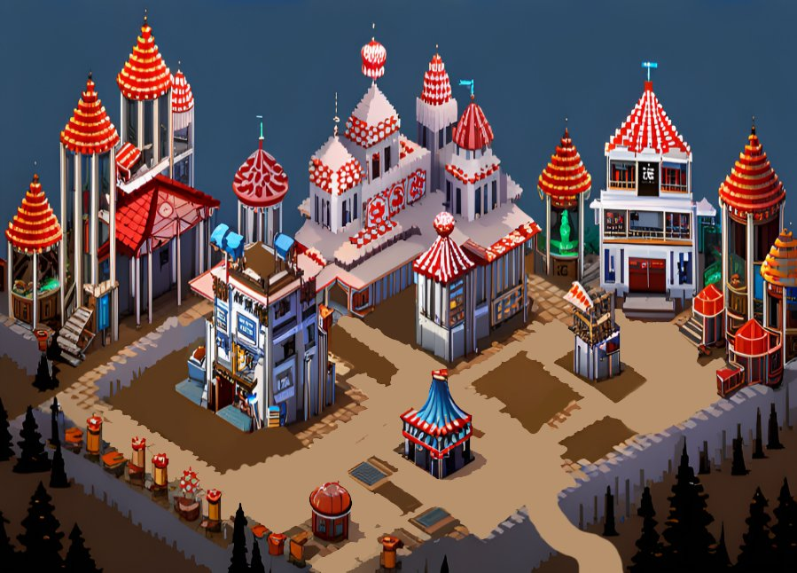
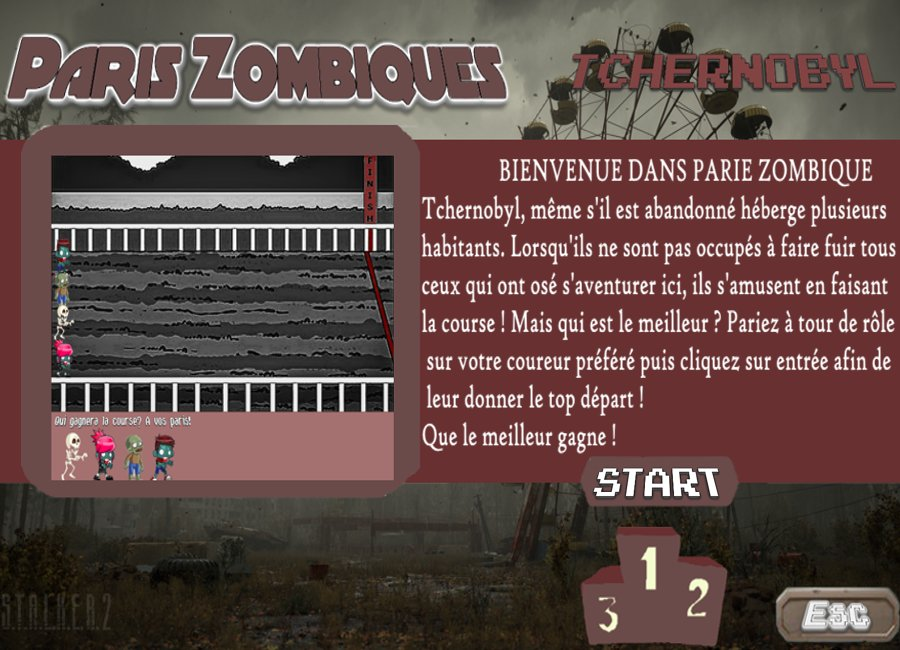
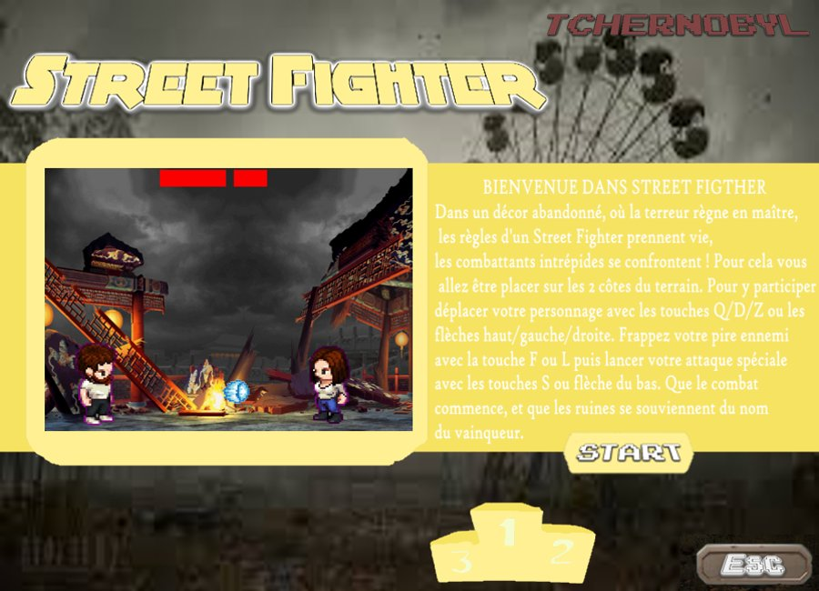
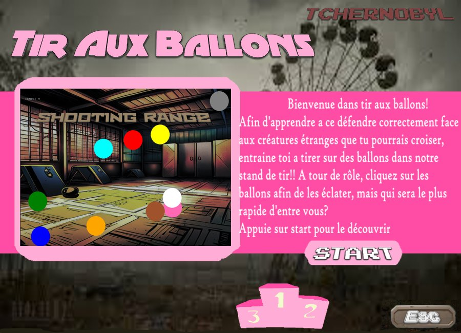
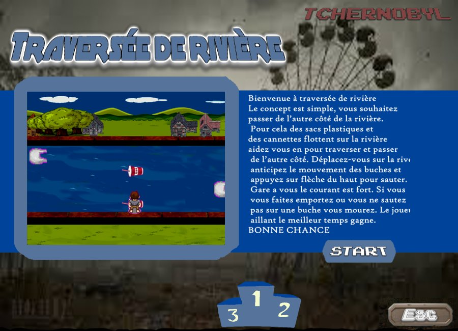
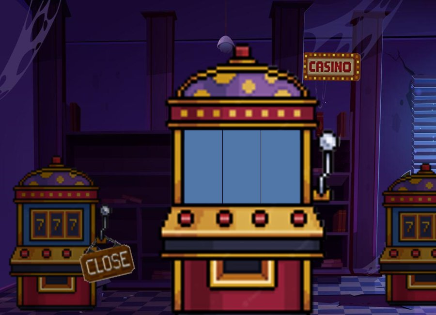

# ECE World - Tchernobyl

Jeu en C avec la bibliothèque Allegro 4, réalisé en équipe de quatre à l'ECE Paris (projet ECE World).

Le thème : un parc d'attractions abandonné. Deux joueurs se déplacent sur la carte du parc et s'affrontent sur des mini-jeux. Chaque joueur commence avec 5 tickets. Entrer dans un mini-jeu coûte un ticket : le gagnant le récupère, le perdant le perd. Le premier qui n'a plus de ticket a perdu.



## Mini-jeux

- Guitar Hero : appuyer sur les bonnes touches au bon moment.
- Jackpot : machine à sous (levier ou touche Entrée).
- Flappy Bird.
- Paris zombies : chaque joueur parie sur un coureur, puis la course est lancée.
- Traversée de rivière : sauter de bidon en bidon pour traverser sans tomber à l'eau, le meilleur temps gagne.
- Street Fighter : combat en 1 contre 1 avec coups simples et attaque spéciale.
- Tir aux ballons : éclater les ballons le plus vite possible.

## Autres fonctionnalités

- Menu avec règles, statistiques et lancement de la partie.
- Choix du personnage et saisie du nom pour chaque joueur.
- Déplacement sur la carte du parc avec des sprites animés. Les collisions utilisent une carte de collision en couleurs, qui sert aussi à détecter l'entrée dans un mini-jeu.
- Écran de chargement animé, animations de victoire et de défaite.
- Les résultats de chaque partie sont enregistrés dans `statistique.txt` et consultables depuis le menu.

## Captures

| | |
|---|---|
|  |  |
|  |  |
|  |  |
|  |  |

## Compilation

Le projet a été développé sous Windows avec MinGW et Allegro 4.4 (voir `CMakeLists.txt`).

```bash
mkdir build && cd build
cmake ..
cmake --build .
```

Le programme charge ses images (`.bmp`) depuis le dossier parent de l'exécutable (`../`). Ces fichiers ne sont pas dans ce dépôt.

## Limites

Tout le code est dans un seul `main.c` d'environ 2 700 lignes. Il faudrait le découper en un fichier par mini-jeu pour qu'il soit plus lisible.
